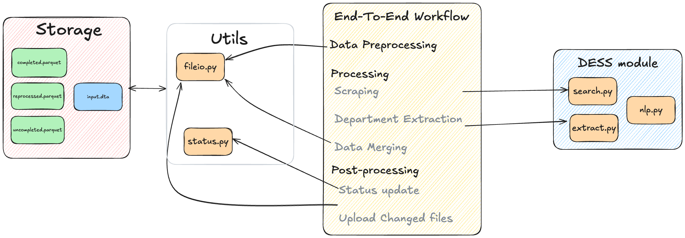

# DESS: Department Extraction using Search and spaCy
The DESS tool processes a file containing faculty names and their respective universities to populate the department column in this file.

## Project Structure

```
DESS/                               # Root directory
├── README.md                       # Project documentation
├── data_pipeline_manager.py        # Module for handling Dropbox interactions
├── workflow.ipynd                  # Entry point for running DESS
│
├── dess/                            # Core application folder
│   ├── nlp.py                       # Module for extracting departments
│   └── search.py                    # Module for performing Google searches
│
├── requirements.txt                 # Python dependencies
├── .env                             # Environment variables (e.g., Dropbox API keys)
```

## Workflow


The workflow is composed of the following stages:
1. **Data Prereprocessing**: The input file is merged with internal existing parquet files, and relevant columns are added to uncompleted.parquet.
2. **Scraping**: The processing script runs on uncompleted.parquet using 
`search.py`. This stage can be run in parallel.
3. **Department Extraction**: The populate_faculty function is called on the file using nlp.py.
4. **Data merging**: The scraped and faculty-filled information are merged with other internal files using data_pipeline_manager.py.

## Running DESS
To run DESS, follow these steps:
1. Ensure you have the necessary dependencies installed by running `pip install -r requirements.txt`.
2. Create a `.env` file in the root directory and populate it with the necessary environment variables (e.g., Dropbox API keys).
3. Run the workflow script (`workflow.ipynb`) using Jupyter Notebook or any other compatible interface.
    - This file includes documentation and code required for the entire workflow. Namely:
        - *Data-processing* — Includes functions to convert stata input file to internal data format, merge with existing files.
        - *1-scraping* — While this can be run from within in the notebook, running in detached console is preferred. See step 4 below.
        - *2-department extraction* — Takes a dataframe as input and returns a dataframe with faculty information added.
        - *- 3-data merging* — Stitches together files from parallel scraping efforts and merges back with existing files.
        - *post-processing steps* — Generates stats based on existing files to provide an overview of conversion and completion ratios, as well as backups to Dropbox.
4. To execute just the scraping scrpt, run `python3 dess/search.py`. To ensure system doesn't sleep while running and to pick up where last left of, consider running:
    ```bash
    caffeinate -dui python3 dess/search.py [start_index]
    ```
5. To monitor the progress of the scraping script either check the console output or run the `stats.get_chunk_processing_stats(df_u, CHUNK_SIZE=200)` cell in the corresponding `workflow.ipynb` notebook.
